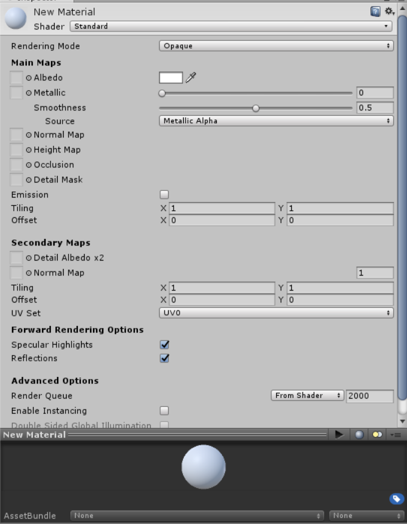
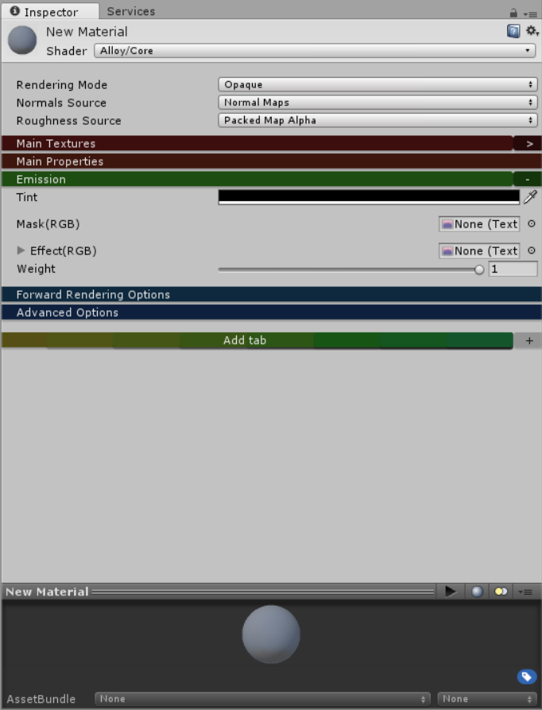
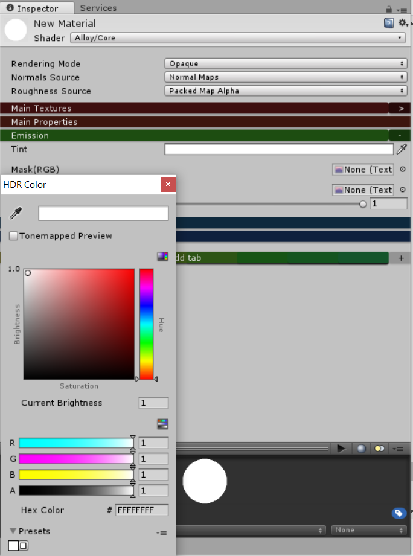
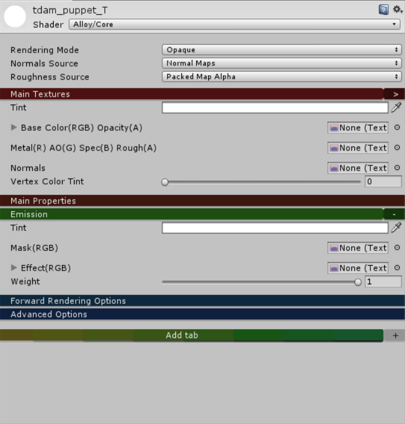
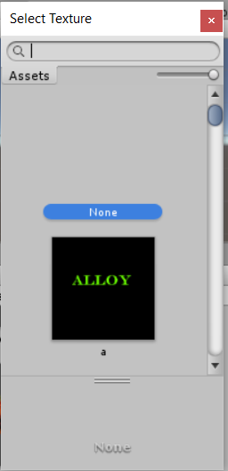
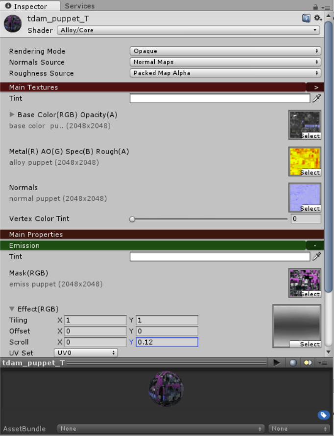

So, you should have Unity 5.6.3 installed by now, right?

If this is your first time using it, do not panic, you'll only be needing it for two minutes, honestly.

That being said, lemme state a few rules to this process that I've discovered the hard way:

**Rule 1)** Every animated skin you make, you need to make a new material for it. You CANNOT use the same material for
two skins.

Using the same material on two skins will result in one skin being an abhorrent mess of the other skin's textures.

**Rule 2)** Every Material you make, you need to include new, unused PNGs for it. You CANNOT use the same PNGs for two
skins.

This mainly applies to Incandescence Maps. We'll be talking about scroll speeds soon, but if you use the same incan.png,
than there will be only one speed, not two.

Lets get started.

Opening Unity should result in something like this. Lets begin by making a subfolder in this main folder, "Assets", and
I'll call this subfolder, "am" (for Animated Material)

In this subfolder "am", I'm going to make another folder based off of the skin I'm making. This subfolder will have my
PNG exports.

The quick way would be to drag and drop your pngs in this category, but if you plan on making multiple animated skins,
this will get clutter-some real quick.

Instead, make a copy of your exports, put them somewhere else, than add a codename to them.

After you give them a codename, import those pngs into the dedicated folder under **Assets --> am**

Yeah, making multiple animated skins, this is what it'll look like in the long run. Anyway...

So now that we have those pngs on Unity, go back to **Assets**...

Here is where I store my Animated Materials, and there is a reason behind it that we'll get to in the hotmodding step,
but for now, follow my example.

Right click, and choose "Create"

A bunch of options will pop up, but we'll be looking for "Material"

A new material made, you're now going to want to look to the right.

The Shader set to "Standard" needs to be changed into "Alloy/Core". Left click the shader...

And locate the category "Alloy". Down this collection, look for "Core".

Your information should now change to something far more simple than prior. Phew! Nothing too crazy here!

Before we crack it open, we will need to add one more thing though. Look for the "plus" symbol next to the "Add Tab"
category...

And select "**Emission**" to the categories.

Your result should be like this. Now, one more thing, there is a tint to this Emission category...

Bump that up to its max, at all white, for the full effect.

Alright! This material is ready to go!

Now, it's not gonna be called "new material" forever, but this next step is important.

{: .warning }
> The name you give your material will be needed for the hotmodding step, so keep it simple!

Lowercase, underscores, and keep it small. All my animated materials start with "tdam_" but yours can be different.

For this example, my material is called "tdam_puppet".

The only categories we'll be focused on in "Main Textures" and "Emission", these are where those PNG exports will go

Right next to the empty spaces are tiny circles, select them...

A popup should appear. (This is where the codenames come in handy, use the search bar to aid you)

Find the select pngs that go with each category. Base Color needs base color.png, Metal needs alloy.png, Normal needs
normal.png--

Holup

When you apply the normal map, a prompt saying "fix now" appears. Tap that and we will continue

Now, to the Emissive.

Mask needs emiss.png, and Effect needs incan.png--

STOP

There is more to that Incandescence Map. Mainly, the scroll effect.

X and Y, X is horizontal scroll, and Y is vertical

X --> -numbers go left, +numbers go right

Y --> -numbers go down, +numbers go up

My example is .12 but yours can be anything else (within the limits between 0 and 1/-1)

If you forget this, your skin won't be animated, so don't forget!

Now that you have your pngs inside this material, lets address the elephant in the room.

Asset Bundles. "None" needs to go. You'll be renaming it to something else, and that name does matter, so I HIGHLY
recommend you use the same name as your material.

Select "New...", then name it as you will, but I'll be naming mine the same as the material.

Visit your pngs and include them in the same bundle as the one you made.

Lastly, there is something included with your template. The Core shader. That needs to be included as well, elsewise...

This happens.

So be sure you have included for every skin you make!

Up above look for "Window"

A lot of options come up, but you're going to be selecting "**AssetBundle Browser**"

A new pop up will appear. Yours won't have as many categories, but the one we're focused on is the current bundle, which
we named the same as our material, right?

A good time to check to see if you have everything. Seven things: Material, Shader, and the five PNGs you have.

If you have these seven things, move on to the "**Build**" option.

Now, this is the Unity Export. The result will be a file that will be used for the hotmod, and this file will enable
animated skins for that weapon.

That being said, another recommendation, make a folder called "mat" where you have your textures located.

Make this the place where you export. Back on Unity, browse and locate this "mat" folder, then build it.

It takes my computer a half a minute, your mileage may vary.

Once built, you are all done!

Now... The hotmodding..

On to [Animated Skins - Hotmodding](animated_hotmod).
