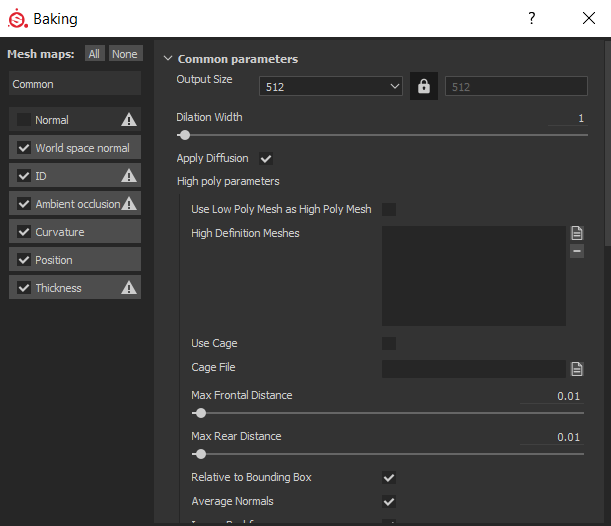
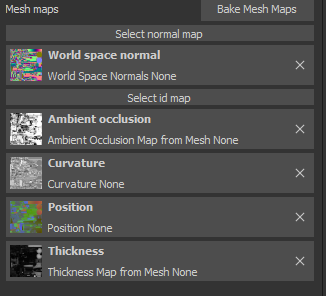
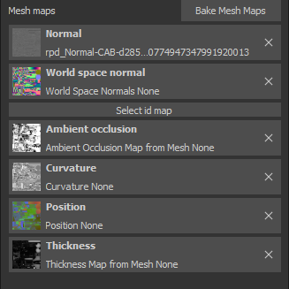
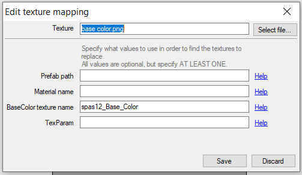
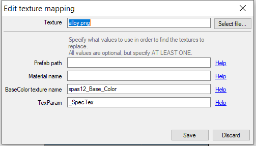
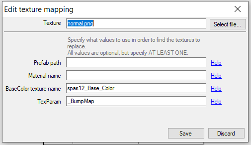

## Table of contents
{: .no_toc .text-delta }

1. TOC
{:toc}

# 1. Tools

Once you got H3VR skin-ready, we can move on to the Meat and Potatoes: making skins for guns! You will need various
programs to get started!

Tools needed:

- [UABE (Unity Asset Bundle Extracter)](https://github.com/DerPopo/UABE/releases) (to gather meshes and textures from
  H3VR's asset files)
- [Blender](https://www.blender.org/download/) (To package the meshes into a 'canvas')
- [Substance Painter](https://www.substance3d.com/subscribe/) (the recommended program in making skins, it does cost
  money but if you are a student, you can register for a license for educational purposes, look for "special offers for
  education")
- SkinPacker.exe (the application that makes hotmods for
  you) [(Direct Download)](https://github.com/denikson/H3VR.Sideloader/releases/download/v0.3.2/SkinPacker.exe)
- ["Alloy" preset for Substance Painter](https://cdn.discordapp.com/attachments/705213552683646986/725554639763669032/Alloy.spexp)
- [Alt Link for "Alloy"](https://www.mediafire.com/file/pl4wxtrj9yxlfae/Alloy.spexp/file)

# 2. Meshes and Textures

{: .note }
> Select guns are pre-packaged and ready to be made into skins thanks to yours truly. You can totally skip these parts if your gun is in these packs! Hundreds of gun canvases to choose from, look down below in the ['Extras'](#extras) for "Skinmaker Skips".

Once we have our tools, it is time to use them.

**1) Open up your H3VR File Location.** This can be done on the Steam App, where you find H3VR in your library, select "
properties", then hitting the option "Open File Directory"

Alternatively, you can search within your computer: PC --> Drive --> ProgramFiles (x86) --> steam --> steamapps -->
common --> H3VR

**2) Locate and Duplicate your "StreamingAssets".**

You can find these files as you progress through the folders:

H3VR --> h3vr_data --> StreamingAssets

Asset files that you'll be using will be found here.

Examples being Assets_Weaponry_ObjectIDs_(NAME) [Name being "Rifle", "SMG", "Support", and so on]

NOTE - i highly recommend making a copy of these asset files, and pasting them in a dedicated Skinmaking Folder

Open UABE

File --> Open

Locate these asset files (If you made a copy, find the copy in your skinmaking folder instead of the one in
StreamingAssets)

Select which one you think the desired gun/ammo/item you want to skin will be

Once you select the asset file, UABE will request to unpack it, select "yes"

It will ask you to make a new file

Don't replace the old StreamingAssets file, make a new file with 'U' or 'Unpack' inside of it to make it different from
the others.

This will duplicate that asset file in a way that UABE can view and extract it.

**3) Locating Mesh and Textures within the unpacked asset file**

[Video Tutorial made by Moorus](https://www.youtube.com/watch?v=_vkgVzBYYQY)

After step 2, the assets will be ready to view and extract.

Select "Info" with the unpacked file selected

A page will pop up with a lot of random information!

Up above, there are ways to sort this madness!

I recommend this, click on "Name", then "Container", then "Type"

Now, the madness should be much easier to read!

(I recommend making a folder in your dedicated Skinmaking folder. Call it by the item's name, then make three folders
inside that - Tex, Mesh, and Workshop)

Lets get started with finding the Textures.

They fall under the type, "2DTextures"

Once you find the type, look through the Containers for the item you are looking for.

When you find the container, you will need three primary maps -- Base Color, Alloy, and Normal

If you are having difficulty finding these files:

Look into the "magazine" container for your item as they can be found there sometimes If you are seeing more than three
textures under your desired item's container, download those as well When you find these textures, select all of them,
then hit "Export" off to the left of the window.

Save as "PNGs"

Put them somewhere where you can find them. (If you made the dedicated folder, Tex would be the place to put them)

Now, time to find those Meshes.

They fall under the type, "Mesh"

Not "MeshRenderer", not "MeshFilter", "Mesh".

Same as you did for the Textures, once you are within the type, locate the container.

Once you find the container, locate all the parts connected to said container.

Select all of them.

Export as a Blender compatible file, such as DAE or OBJ (OBJ recommended, see extras for a 'multiple obj export' tool
for Blender)

Save in a location close to those Texture files (If you have that dedicated folder, these would be placed in Mesh)

{: .note }
> If your item uses a magazine, check under the 'magazine' containers for any additional meshes belonging to your item.

# 3. Blender
Now that you have both the textures and meshes, we can move to the next big step!

Close UABE and Open Blender!

Once it's open, delete that general square!

Go up to File --> Import

Import the files based on what type you saved it as.

One by one by one, and as you go, space the meshes so that there a few inches away from one another.

If you have a receiver, or a main portion, make that the center of it all.

When you got all the meshes into the scene, this next part might confuse you

Select the first mesh on your list of items in the "scene"

Locate these options on your toolbar

That red orb? Click on it.

It will open up a small list, and will have one line that states a material.

Delete that material by hitting the "-" button.

It your list should now look like this.

Do this for every single mesh in your scene!

After you do that, then your canvas will be ready for the next step!

Save your blender project wherever you want (Under Workshop if you have a dedicated folder, call it [NAME OF ITEM]
.blend)

Then, export your canvas as an OBJ file (This will also go to your Workshop folder)

# 4. Painting
Now we can get on to the fun stuff!

Close Blender

Open Substance Painter

If this is your first time loading up Substance Painter, this is where that Alloy.spexp file comes in

Locate that file and drop it into Substance Painter's "Shelf" tab.

A page will pop up, and Alloy will be auto-determined as an "Export"

To the bottom right, right next to "Import your resources to", select "Shelf"

This will save the export as a permanent feature for all your Substance Painter projects!

Now, the next step:

File --> New

A page will pop up, asking for your Canvas and any additional PNGs for your project.

The first browse option, select the canvas you made using Blender

The second, lower option, click on that and find the normal map that belongs to your item.

Once you have both of these, select 'OK'!

The canvas should now appear on both the 3D View and UV (2D) View.

Don't jump into making a skin just yet though!

Locate "Texture Set Settings" on your toolbar.

Scroll down until you find the "Bake Mesh Maps" option.

This pop up will appear. Your pop up with have "Normal" checked. Un-check that before you bake.

After the baking is done, this should be a result. We're not quite done just yet.

Hit on "Select Normal Map", and locate that Normal Map you chose when you selected your canvas.

If your project looks similar to this, your canvas is ready to be painted on!

# 5. Exporting
Welcome back! It's been two weeks, and you've made a wonderful creation!

Now, time to export it!

File --> Export Textures...

Now before you jump the gun...

Do a double take, does it look like this?

Mainly, the config? Is it "alloy"?

If it ain't, make sure it is, so that H3VR can use it!

Make a folder called [ITEM NAME] - [NAME OF SKIN]

So, for my SPAS skin, it'd be Spas 12 - Bloodspring.

Make sure this folder is selected as the desired export location, then you are ready.

Click on "Export"!

# 6. Hotmods

Now, this should be the last step of the process!

Close Substance Painter

Open Skinpacker.exe!

A very simple window will pop up, but you won't be able to do anything just yet.

Click on "Select Project Folder"

Locate that folder which you exported your Substance Painter stuff in.

By choosing that folder, a popup saying "This folder does not have a manifest file. Create a new one?"

Select Yes.

The main window will now open up with details for you to fill.

GUID - The techy name that Sideloader will use to load up your files. Has to be lowercase, with '.'s or '_'s instead of
spaces.

Name - Self explanatory, the name of your skin, if you gave it one

Version - Also self explanatory, set as "1.0.0". If you set as "1", it won't go any further.

Description - Give it a flavor text or just say "Made by you". Details here are completely optional.

The next part has confused people, but I promise it isn't as complicated as you think.

Click on "Add"

[Open this](https://docs.google.com/spreadsheets/d/1Mjeo410-2wgou9JHSb_I1VltNTyzNXZX_EwhMNsfH6Y/edit#gid=1966002968) on
another tab

This is Ghorsington's handy prefab spreadsheet with details on every gun in H3VR, super useful for hotmodding in
general! Bookmark it!

CTRL + F, and type in a part of the name of your item

Once you located parts of it, look for the main part. Albedo, Diffuse, Base Color, or just the name of the item itself.

Across from the Prefab and Material names, located your item's "_Main Tex"

Copy those details

Back to the Skinpacker

Clicking on "Add" will open a new window for you.

What you need to do first is choose your "base color" export

Hit "Select File"

And choose that "base color.png"

Next, the details to fill out down below

My example, using the Spas, I have the BaseColor texture name "spas12_Base_Color"

For you, it will be whatever that _MainTex entry that you copied from the spreadsheet is.

Paste it in the same location, and "Save".

Now, hit Add again.

This time, for the "alloy.png" file.

Hit "Select File"

Choose your "alloy.png" file.

And then make the entry look like this example.

Yes, it looks the same as the picture above. The simplicity of pasting the BaseColor Texture Name makes this process
both easy and slightly confusing.

_SpecTex for the TexParam entry specifies it is the Alloy entry, and is the key difference between the first entry you
made.\

Click on "Save" when you get a similar match comparing it to the picture above.

Now, can you guess what to do for the "normal.png" file?

Yup. Same thing, except you select the "normal.png" file up above, and the TexParam is now _BumpMap.

This is the last entry needed.

"Save" when you get this part done.

Click on "Save Manifest"

Then, last part, "Pack into .h3mod"!

For my example, I'd call it "spas12_bs", so nameofitem_name is recommended for your skin, but you can call your skin
whatever.

The hotmod will save where the pngs and manifest is located. This hotmod will be bonafide ready for Sideloader to use.

*Wait... What's Prefab Path and Material Name used for, then?*

Prefab Path and Material Names are extra details to specify when "BaseColor Tex Name" is waaay too ambiguous.

Example, want to know what the Desert Eagle 44's _MainTex is called?

"Albedo"

Which is also the same as the C1851 Conversion

And they will share those same textures if no further details are added

So the prefab path would be

h3vr_data\streamingassets\assets_resources_objectids_weaponry_pistols\deserteagle44

Or you could use the material name entry

mtl_Deagle_Matte

Either would be enough to prevent the C1851 from being affected by your hotmod.

Do keep a cautious eye for _MainTex names that seem a bit too broad!

***CONGRATS!*** You know the basics of making skins! You are now ready to make all sorts of skins!

But! Stick around! There's more to learn about what you can do for your skins in
the [Skin Making Advanced](../skin_making_advanced/stamp) course!

# Extras

Hey! Thanks for reading this guide! Here are a few extras that will be of use to you!

## Skinmaker Skips

[Skinmaker Skip I](https://www.mediafire.com/file/ywizbrtzyr3ks99/TD%2527s_Skinmaker_Skip_V2.9.zip/file)

[Skinmaker Skip II](https://www.mediafire.com/file/2clbvged8q9wele/TD%2527s_Skinmaker_Skip_II.zip/file)

[Skinmaker Skip III](https://www.mediafire.com/file/5ira6qk23gy767o/TD%2527s_Skinmaker_Skip_III_V1.1.zip/file)

[Skinmaker Skip IV](https://drive.google.com/file/d/18epbWVZOkfDDeELaKsGtcvoSGi_TYzMw/view?usp=sharing)

These four folders contain almost a hundred canvases ready for Substance Painter.

OBJ Files, Textures, and a manifest for you to copy and paste where your skin export is located, so that the Skinpacker
autofills for you almost all the details needed to make a Hotmod.

It's a handy tool that should cut the time substantially if that gun you were gonna make a skin of is within these
packs!

[Import Multiple Obj files in Blender python script](https://www.mediafire.com/file/v802g3ufu844pt0/io_import_multiple_objs.py/file)

From one skinmaker to another, this was passed to me to help cut time, and it does!

If you can't find your gun in the skinmaker skips, use this to cut time instead.

Install this plugin to Blender [(guide)](https://blendersensei.com/definitive-guide-to-installing-blender-addons/)
