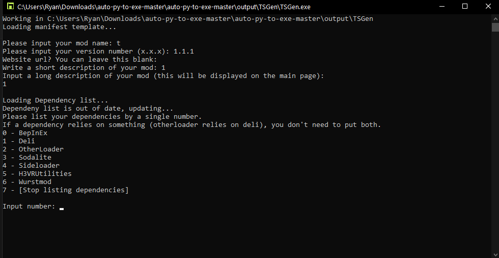

{:toc}

# 1. Preparing Your Manifest And Package

If you would like to check your files before uploading, please see [TSGen.Check](https://github.com/nayr31/TSGen.Check).

{: .note }
> Windows defender or other antivirus programs may interfere with the mentioned programs, either run them as administrator or let them through temporarily.

## Required files for Thunderstore

Thunderstore requires 3 files to be present in your `.zip` upload:

- An icon, 256x256 in size
- A Thunderstore manifest that contains information about your mod
- A README file that displays text and images on your main page

The best thing to do is to log into Thunderstore using Discord or Github and checking the full details on
the [upload page](https://h3vr.thunderstore.io/package/create/).

Please see the [Creating a Thunderstore Package](creating.md) page for details on how to place your mod into this file
structure. After which, all you need to do is zip the files inside of the mod folder and upload it.

## Using TSGen to Generate required files

Head on over to [TSGen](https://github.com/nayr31/TSGen)'s github and download their latest release. You probably want
to download `TSGen_Extract_This.zip` and extract it to it's own folder.

Running `TSGen.exe` will greet you with this page:


TSGen will prompt you for some general information about your mod:

- Mod name
- Version (It needs to be in the x.x.x format)
- Website url (usually for github links)
- Short description (displayed beside your mod in r2modman)
- Long description (displayed in the README file on the main page of your mod)

Next, it will prompt you for dependencies that your mod uses.



Input the number that corresponds to the top level dependencies you need.

Example:

```text
Mod A requires WurstMod, Deli, and BepInEx

WurstMod requires Deli

Deli requires BepInEx

So Mod A's dependencies are:
- WurstMod
```


In the above picture you can see what the example would do in it's situation. You can close TSGen now by hitting enter
or by closing the window.

Inside of the extracted TSGen folder, you should see a folder by the name of your mod:

```text
[Your mod name]/
    icon.png
    manifest.json
    README.md
```

# Manual Creation

{: .note }
> The manifests created from TSGen can still be modified using this section.

### icon.png

`icon.png` is a box 256 pixels wide and tall. It is the icon that will be displayed on the Thunderstore website. Note
that it *must* be 256x256. If you are new to making images, a tool such
as [paint.net](https://www.getpaint.net/index.html) can be useful for making quick images, as they are relatively easy
to learn.

### manifest.json

The default manifest looks like follows:

```json
{
  "name": "My_Mod_Name",
  "version_number": "1.0.0",
  "website_url": "https://thebestsiteevermadeforh3vrmodding.com",
  "description": "My mod is definitely a mod (250 characters max)",
  "dependencies": [
    "Author1-FirstDependency-Version",
    "Author2-SecondDependency-Version",
    "Author3-ThirdDependency-Version"
  ]
}
```

The name must not contain spaces. Replace your spaces with `_`s.

The `website_url` can be empty (`"website_url": "",`) if you do not have a website.

Dependencies are taken from the Thunderstore website. They are mods that your mod relies on. They can be seen from their
page on Thunderstore. Copy and paste the string listed to your dependencies.


{: .note }
> Once you have uploaded a mod under a name, *the name cannot be changed.*
> Also, it must be noted that *you can only upload once per version*. If you upload v1.0.0, you must change your version next time you upload.

### README.md

The README.md is the description by the mod. Often forgotten because it is not visible through the Mod Manager (As of
yet, anyway), it is what displays on Thunderstore when you click on a mod. You can test your markdown
through [Thunderstore's Markdown Preview tool.](https://h3vr.thunderstore.io/tools/markdown-preview/) If you're new to
Markdown, [check out this guide!](https://www.markdowntutorial.com/)
Once you've fancied up your description, make a new text file and rename it to `README.md`. Open it up using a text
editor and paste your fancy text.

Once you have these three files, you should end up with this:

```text
[Your mod name]/
    icon.png
    manifest.json
    README.md
```

Please see the [the next step, Adding Your H3VR Content To Your Package](creating) page for details on how to place
your mod into this file structure.

# 2. Adding Your H3VR Content To Your Package

Depending on the [mod format]({{site.baseurl}}/docs/installing/mod_formats), you will need to package your mod differently by using folders.

{: .note }
> The `[Your mod name/]` line refers to the `.zip` file you will upload to Thunderstore.

## Stratum mods

To create a stratum mod, check out
the [Mason Getting Started guide.](https://h3vr-modding.github.io/Mason/getting_started/index.html)

To build your Stratum mod, you must first make your manifest, so you might want to check out the second part first.

## Deli mods

No folder needed, place your `.deli` file inside of your mod folder.

```text
[Your mod name]/
    [Your Deli File].deli
    [Your Second Optional Deli File].deli
    icon.png
    manifest.json
    README.md
```

## Sideloader mods

Place your `.h3mod` or `.hotmod` file inside of a folder called `Sideloader` inside of your mod folder. A `.h3mod`
and `.hotmod` are identical; they just end differently.

```text
[Your mod name]/
    Sideloader/
        [Your Sideloader File].h3mod
        [Your Second Optional Deli File].hotmod
    icon.png
    manifest.json
    README.md
```

## Asset bundles

Place your assets inside of a folder inside of your mod folder called `LegacyVirtualObjects/`.

```text
[Your mod name]/
    plugins/
      LegacyVirtualObjects/
        [Your assetbundle file]
        [Your assetbundle file].manifest (optional)
    icon.png
    manifest.json
    README.md
```

## TnH Music

No folder needed, place your `.bank` file inside of your mod folder.

```text
[Your mod name]/
    MX_TAH_[MyEpicMusicModNameHere].bank
    icon.png
    manifest.json
    README.md
```

Now that your files are compiled together, zip your files together and head on over
to [Thunderstore](https://h3vr.thunderstore.io) to upload your mod. Make sure to log in, then press the `Upload` button
in the top left. Set it's category, drag your `.zip`, and hit upload.

# Making Modpacks


Got a list a mods you would like to share with the community? Take a look at the steps below for information on creating
a mod pack.

## Recommended software

It is recommended to use [Visual Studio Code](https://code.visualstudio.com) if your modpack has a large amount of mods.
This program is simply a fancy text editor, and will help with multi-line editing of text. If you have an alternative,
or would like to avoid it then that is completely fine.

## What is a mod pack?

A mod pack is simply a list of mods that [r2modman](https://h3vr.thunderstore.io/package/ebkr/r2modman/)
or [Thunderstore mod manager](https://www.overwolf.com/app/Thunderstore-Thunderstore_Mod_Manager) use to install all
listed mods at once, making it very convenient.

This means that it is just a regular mod you would upload, and can include it's own custom content.

The [creating](creating) and [uploading](uploading) pages are for other mods, so this one will be modpack
specific.

## Getting your list ready

{: .note }
> The term "string" is used to describe a length of text, and is used in programming. More information [here](https://www.tutorialspoint.com/computer_programming/computer_programming_strings.htm), although it is not required for this guide.

Have the perfect mod list ready to go in r2mm or tsmm? Great!

1. In r2mm/tsmm, select the profile you would like to reference your modpack on.
2. Click on the "Settings" button on the left.
3. Change from the "All" tab to the "Modpacks" tab.
4. Click on the "Show dependency strings" button. This will open a list of strings that we will use for creating the
   list.
5. Copy the strings and paste them into a text file so you don't lose them.

If your profile has no mods installed in it, the list will be empty. If you still want to make a modpack but don't have
this:

1. Open a text file and [Thunderstore](https://h3vr.thunderstore.io).
2. Open the mod page of a mod you would like to include in your mod pack.
3. Just under the title and short description, there are a few fields that describe the last update and total downloads,
   etc. Below these are something called a "Dependency string". Copy the entire thing and paste it inside of your file.
4. Repeat for all mods you wish to include, pasting each string on a new line.

---

Now that you have a file with a list of each dependency string inside of it, we are going to format it so that it will
be easier to copy and paste it in the next step.

These steps assume that you are using a multi-line editor like [VSCode](https://code.visualstudio.com). Here is
a [reference site](https://tahoeninjas.blog/2019/03/30/multi-cursor-editing-in-visual-studio-code/) for shortcuts.

Before example:

```text
BepInEx-BepInExPack_H3VR-5.4.1101
BepInEx-MonoMod_Loader-1.0.0
nrgill28-HookGenPatcher_H3VR-1.2.3
nrgill28-Sodalite-1.0.0
```

1. Select the leftmost point in every line (before any text).
2. Add a `"` to it.
3. Select the rightmost point in every line (after any text).
4. Add a `"` to it.
5. Select the rightmost point in every line except for the last (after any text).
6. Add a `,` to it.

After example:

```text
"BepInEx-BepInExPack_H3VR-5.4.1101",
"BepInEx-MonoMod_Loader-1.0.0",
"nrgill28-HookGenPatcher_H3VR-1.2.3",
"nrgill28-Sodalite-1.0.0"
```

Leave this file aside for now.

## Making the manifest

A manifest is what tells the website the information about your mod. Go ahead and copy the example below into a new file
called `manifest.json` (case sensitive).

```json
{
  "name": "TestMod",
  "version_number": "1.1.0",
  "website_url": "https://github.com/thunderstore-io",
  "description": "This is a description for a mod. 250 characters max",
  "dependencies": [
    "MythicManiac-TestMod-1.1.0"
  ]
}
```

You can find specific information about this file on
the [old upload page](https://h3vr.thunderstore.io/package/create/docs/), but we will go over what you need to change.

1. Give your modpack a name.
    1. Do this by changing the `"name"` field, making sure to keep it inside the quotes.
    2. This is the only unique identifier of your mod! If you change it, you will instead upload another mod!
2. Change the version number to something normal, like `"1.0.0"`.
    1. You can find information about what these numbers mean on the [official document](https://semver.org).
3. The website url can be blank, so you can change the `"https://github.com/thunderstore-io"` to `""`.
4. The description shown is what is displayed on the main page, and is the main selling point of your pack. Keep this
   shorter than 250 characters.
5. Delete the `"MythicManiac-TestMod-1.1.0"` in the dependencies section, and replace it with the list of dependency
   strings that we made in the previous step.

Here is an example of a finished manifest:

```json
{
  "name": "Cool guys only",
  "version_number": "1.0.0",
  "website_url": "",
  "description": "The coolest modpack, yo.",
  "dependencies": [
    "BepInEx-BepInExPack_H3VR-5.4.1101",
    "BepInEx-MonoMod_Loader-1.0.0",
    "nrgill28-HookGenPatcher_H3VR-1.2.3",
    "nrgill28-Sodalite-1.0.0"
  ]
}
```

## An icon, and a readme

There are two other files required before you upload:

1. An icon named `icon.png` (case sensitive), 256x256. This is non-negotiable.
2. A file called `README.md` (case sensitive). This is displayed on the main page of your pack.
    1. The `.md` extension stands for markdown, and is essentially a fancy text file. You can just write out whatever
       you want in here.

Here is an example of the `README.md` file:

```md
# This is the coolest title

Some example text.

## But then this one is smaller

With some other text.

- A bulleted list
- With some cool text

1. A numbered list
2. With some other cool text

## A changelog is nice

### v1.0.1

This is cool too

### v1.0.0

This is cool
```

Thunderstore even has [a page to test it live](https://h3vr.thunderstore.io/tools/markdown-preview/)!

## Configs

If you would like to include your modified configs:

1. In r2mm/tsmm, click on "Settings" on the left.
2. Click on "Browse profile folder" (should be the second option in the list).
3. In the file explorer that opened, open the `BepInEx/` folder.
4. Make note of the `config/` folder, and when told in the next step to zip your files, include the entire folder inside
   of the zip.

This will look like this instead of the other example given.

```text
Mockpackname.zip/
    config/
        ...
    icon.png
    manifest.json
    README.md
```

## Uploading your mod

After you are done making the required files:

- `manifest.json`
- `icon.png`
- `README.md`

You can zip them up (select all, right click, send to, compressed zip) and head on over to
the [upload page](https://h3vr.thunderstore.io/package/create/) to upload your mod.

Here is what it should look like:

```text
Mockpackname.zip/
    icon.png
    manifest.json
    README.md
```

Make sure that you are logged in, select your team, and select "Modpacks" as your category.

Click submit, and if there were no errors, your pack should be uploaded.

If you did get an error, you can use [this page](https://h3vr.thunderstore.io/tools/manifest-v1-validator/) to test your
manifest.

If it says the manifest is fine, then you are missing a file, or your icon is incorrect.

# Updating your Thunderstore Package

The following are steps on how to update your mod that is current hosted on Thunderstore.

1. Obtain your mod files. This can either be done by downloading your mod from your Thunderstore page, or by having a
   copy handy from when you uploaded it in the first place. You should have something like this:

    ```text
        MyMod/
            [mod files]
            manifest.json
            icon.png
            README.md
    ```

2. Open your `manifest.json`, and increase the `"version_number"` according to [semantic versioning](https://semver.org)
   . In short, if you are making a patch (minor change, fix) increase the third number (1.2.3 -> 1.2.4). If you are
   making a larger change increase the second number (1.2.3 -> 1.3.0). If you are making an extremely big change that
   adds or changes major things, increase the first number (1.2.3 -> 2.0.0).
3. Change your [mod files] to their newer version, making sure to follow [Thunderstore's packaging rules](creating).
4. Zip your files together once more for upload.
5. Upload your mod in the same place you uploaded it the first time, making sure to select the correct tag(s).

